#  Digital Communication Simulink Project (ELC325)

The following is a simulation for different modulation schemes (BPSK,QPSK,FSK,QAM(16,64)) using simulink. a coded matlab function is also available to achieve the same results.

## Reproducing Results using Simulink 
- Clone the project into an appropriate directory.
  ````
  git clone 
  ````
- While opening matlab, make sure you change the folder directory to the project directory.
- Open the modulation scheme file you want to simulate from the available *.slx files, a block diagram will show up that you can configure as needed.
- From Matlab Console, enter bertool command
  ````
  bertool
  ````
  this will open up the bertool window , choose the *.slx file and the range you want and then click "run".

Note: You can reproduce the results also from the code available by running the main file and changing the passed modulator/demodulator objects.


## Modulation Schemes:

### Binary Phase Shift Keying Modulation(BPSK)
Binary Phase Shift Keying uses variation in phase to represent zeros and ones in a binary message.which means we only need two states in phase to represent the bits in the message.
````
s(t | b == 1) = Ac . cos( 2 . PI . fc . t )	
s(t | b == 0) = Ac . cos( 2 . PI . fc . t +  PI )	
````
where b is the bit being transmitted at instantaneous time t with carrier frequency fc and amplitude Ac.

At the reciever end, a coherent detector(costas/PLL reciever) is used to recover the modulated signal.


#### BER versus Eb/No  ranging from -10 to 10 dB.

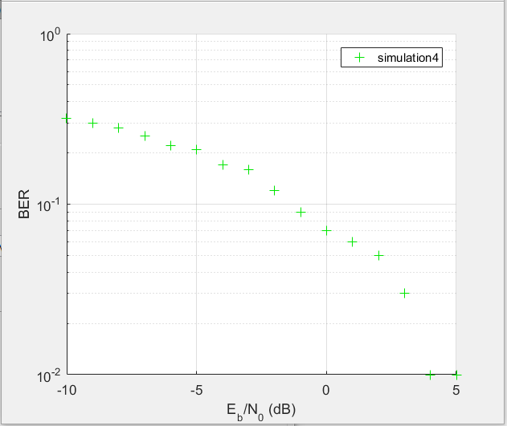
#### Scatters plots at transmitter/reciever ends.

The constellation diagram for BPSK below shows two points on the x axis because it has an inphase component and no quardrature components as it only has one basis function.

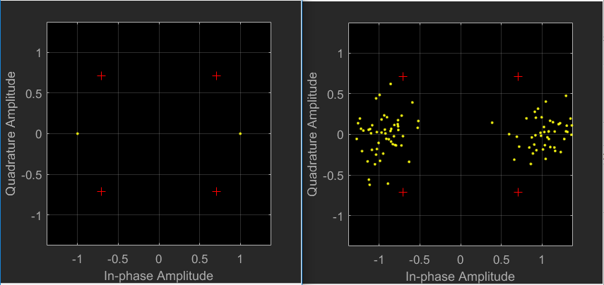


### Quadrature Phase Shift Keying Modulation (QPSK)
Quadrature Phase Shift Keying uses four states/phases which is different from BPSK which uses only two states/phases. QPSK is an optimization over PSK that transmits more information on the same Bandwidth.

#### BER versus Eb/No  ranging from -10 to 10 dB.
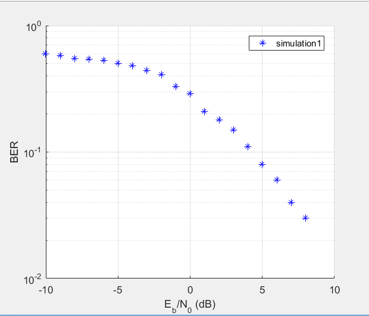
#### Scatters plots at transmitter/reciever ends.
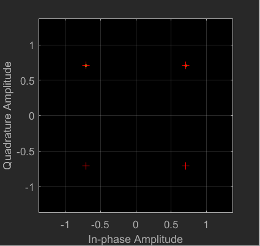
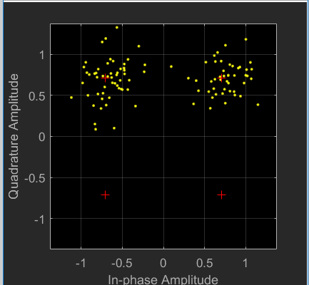


### Frequency Shift Keying Modulation(FSK)
Frequency-shift keying is a frequency modulation scheme in which digital information is transmitted through discrete frequency changes of a carrier signal.For our binary case, it uses a pair of discrete frequencies to transmit information.

#### BER versus Eb/No  ranging from -10 to 10 dB.
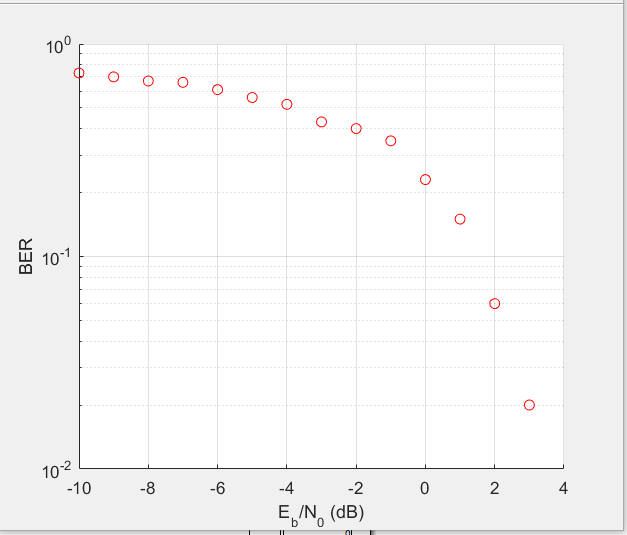
#### Scatters plots at transmitter/reciever ends.
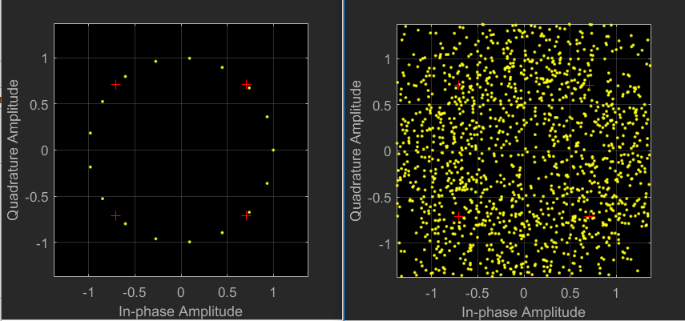

### QAM Modulation
QAM is the general form of Phase shifting keying.in QAM,two carriers (out of phase by 90 degrees) are modulated and combined  which makes them in Quadrature.

#### QAM-16 Modulation
##### BER versus Eb/No  ranging from -10 to 10 dB.
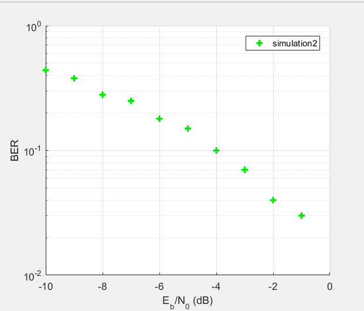
#### Scatters plots at transmitter/reciever ends.
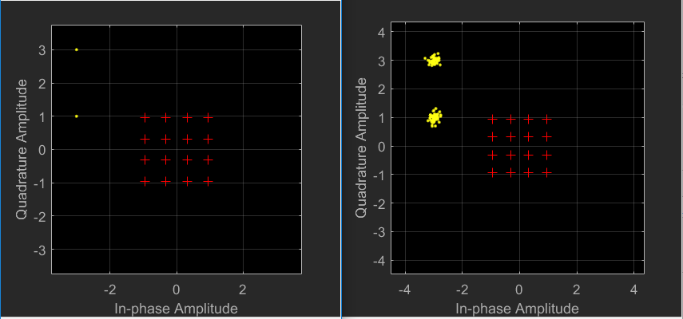


#### QAM-64 Modulation
##### BER versus Eb/No  ranging from -10 to 10 dB.
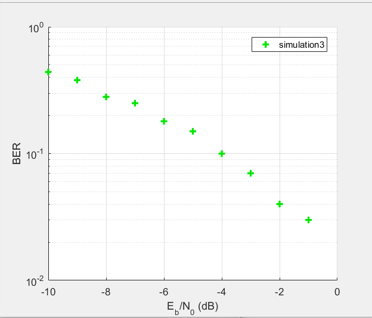
##### Scatters plots at transmitter/reciever ends.
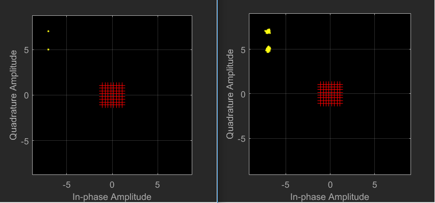
